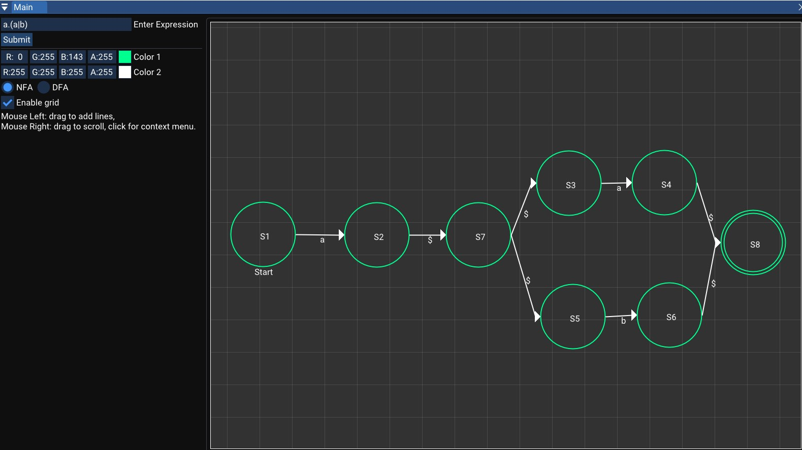
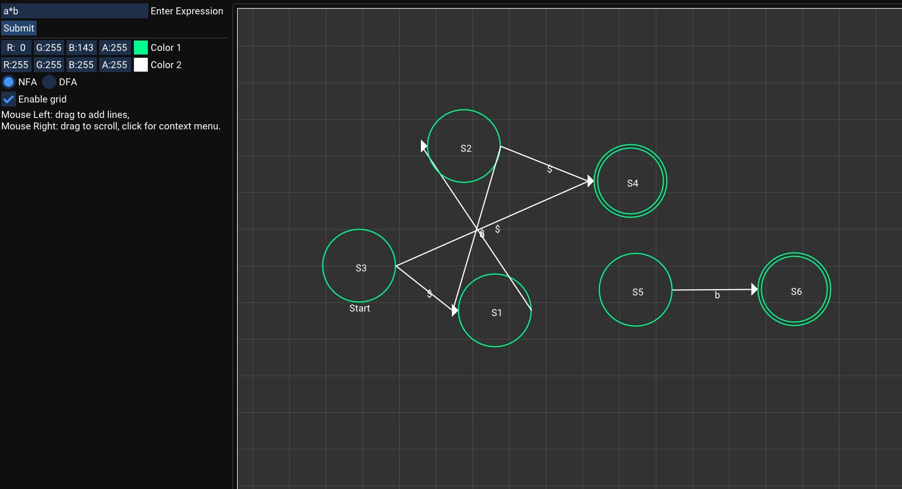
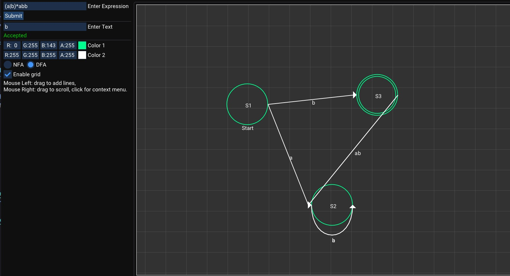

# Regex to Finite Automaton Converter

An interactive visualization tool that converts regular expressions to finite automata (NFA/DFA). Built with C++, Dear ImGui, and Vulkan, this application provides a beautiful, real-time visualization of automaton construction and state transitions.



*Automaton Visualization*

## 🌟 Features

- **Regex to NFA Conversion**: Thompson's construction algorithm
- **NFA to DFA Conversion**: Subset construction method
- **Interactive Visualization**: Drag and rearrange states on canvas
- **Real-time Rendering**: Instant visualization as you type regex
- **State Highlighting**: Visual feedback for accepting states
- **Transition Labels**: Clear display of transition symbols
- **Modern UI**: Beautiful interface with customizable colors
- **Export Capabilities**: Save automaton diagrams

## 🎯 Supported Regex Features

### Basic Operations
- **Concatenation**: `ab` - Match 'a' followed by 'b'
- **Alternation**: `a|b` - Match 'a' or 'b'
- **Kleene Star**: `a*` - Match zero or more 'a'
- **Plus**: `a+` - Match one or more 'a'
- **Optional**: `a?` - Match zero or one 'a'

### Advanced Features
- **Character Classes**: `[abc]` - Match any of a, b, or c
- **Ranges**: `[a-z]` - Match any lowercase letter
- **Grouping**: `(ab)+` - Group and apply operators
- **Escape Sequences**: `\n`, `\t`, etc.

## 📸 Examples


*Example: `a*b` → NFA visualization*


*Example: `(a|b)*abb` → DFA visualization*

## 🚀 Getting Started

### Prerequisites

- [Visual Studio 2022](https://visualstudio.com) (Community Edition or higher)
- [Vulkan SDK](https://vulkan.lunarg.com/sdk/home#windows) (version 1.3.x or later)
- Windows OS (macOS and Linux support planned)

### Installation

1. **Clone the repository**
   ```bash
   git clone <your-repo-url>
   cd Regex-to-Finite-Automaton-Converter
   ```

2. **Run the setup script**
   ```bash
   scripts\Setup.bat
   ```
   This generates Visual Studio 2022 solution/project files.

3. **Open the solution**
   - Open `WalnutApp.sln` in Visual Studio 2022
   - Set `WalnutApp` as the startup project

4. **Build and run**
   - Press `F5` or click "Start Debugging"
   - The application will compile and launch

## 📖 Usage Guide

### Converting Regex to Automaton

1. **Enter your regex** in the input field
2. **Click "Convert"** to generate the automaton
3. **View the visualization** on the interactive canvas
4. **Drag states** to rearrange for better clarity
5. **Customize colors** using the color pickers

### Interacting with the Visualization

| Action | Control |
|--------|---------|
| Drag states | Left-click and drag on any state |
| Pan canvas | Right-click and drag on canvas |
| Zoom | Mouse wheel (future feature) |
| Toggle grid | Use the "Show Grid" checkbox |
| Customize colors | Use color pickers in left panel |

### Example Workflows

**Simple Pattern:**
```
Input: ab*c
Output: NFA with states for a, b*, and c
```

**Complex Pattern:**
```
Input: (a|b)*abb
Output: DFA recognizing strings ending in "abb"
```

## 🧠 Algorithm Details

### Thompson's Construction (Regex → NFA)
1. Parse regex into expression tree
2. Build NFA fragments for basic operations
3. Combine fragments using ε-transitions
4. Result: NFA with single start and accept state

### Subset Construction (NFA → DFA)
1. Compute ε-closure of NFA start state
2. Create DFA states from NFA state sets
3. Build transition table
4. Minimize resulting DFA (optional)

## 🎨 Visual Design

The application features:
- **Modern dark theme** with professional color scheme
- **Circular states** with clear labels
- **Directed edges** showing transitions
- **Accepting states** highlighted with double circles
- **Smooth animations** for state movements
- **Grid overlay** for alignment

## 📁 Project Structure

```
Regex-to-Finite-Automaton-Converter/
├── WalnutApp/              # Main application
│   └── src/
│       ├── WalnutApp.cpp  # UI and visualization
│       ├── RegexParser.h  # Regex parsing logic
│       └── Automaton.h    # NFA/DFA construction
├── Walnut/                # Application framework
├── vendor/                # Third-party dependencies
├── scripts/               # Build scripts
└── README.md             # This file
```

## 🛠️ Technology Stack

- **Language**: C++17
- **UI Framework**: [Dear ImGui](https://github.com/ocornut/imgui)
- **Graphics API**: Vulkan
- **Window Management**: [GLFW](https://github.com/glfw/glfw)
- **Mathematics**: [GLM](https://github.com/g-truc/glm)
- **Framework**: Custom Walnut application framework

## 🔧 Customization

### Adding New Regex Operators

Edit `RegexParser.h` to add support for new operators:
```cpp
// Add new operator to parser
case '&':  // Intersection operator
    return handleIntersection();
```

### Changing Visual Style

Edit `WalnutApp.cpp` to customize:
- State colors and sizes
- Transition arrow styles
- Canvas background
- Grid appearance

## 🎓 Educational Use

Perfect for:
- **Theory of Computation** courses
- Understanding automata theory
- Learning regex patterns
- Compiler design education
- Algorithm visualization

## 📝 Future Enhancements

- [ ] DFA minimization visualization
- [ ] Step-by-step conversion animation
- [ ] Export to GraphViz format
- [ ] Import automata from file
- [ ] Regex testing with input strings
- [ ] Performance optimization for large automata
- [ ] Support for more regex features

## 🐛 Troubleshooting

**Application won't start:**
- Verify Vulkan SDK is installed
- Check graphics drivers are up to date
- Ensure Visual Studio 2022 is installed

**Regex not parsing:**
- Check for balanced parentheses
- Verify operator syntax
- See supported features list

**Visualization is cluttered:**
- Manually drag states to better positions
- Use simpler regex patterns
- Adjust canvas zoom (future feature)

## 📄 License

This project includes components under various licenses:
- Walnut Framework: MIT License
- Dear ImGui: MIT License
- GLFW: zlib/libpng license
- GLM: MIT License

## 🙏 Acknowledgments

- Built on the [Walnut](https://github.com/TheCherno/Walnut) framework
- Uses [Dear ImGui](https://github.com/ocornut/imgui)
- Inspired by automata theory and compiler design principles

## 📧 Contact

For questions, suggestions, or contributions, feel free to open an issue!

---

**Note**: This is an educational project demonstrating automata theory concepts through interactive visualization.
